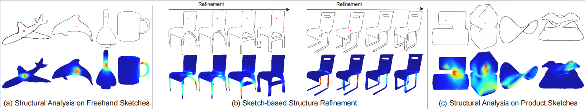
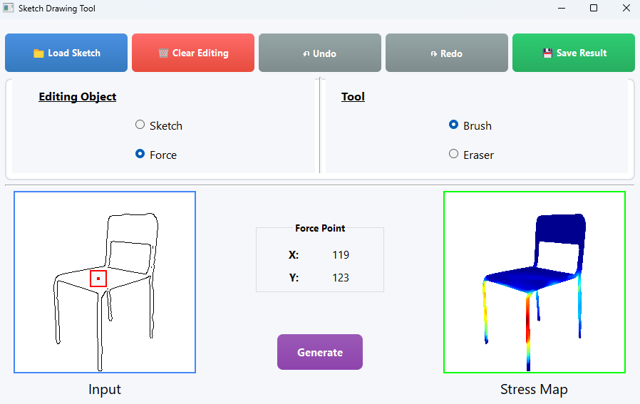
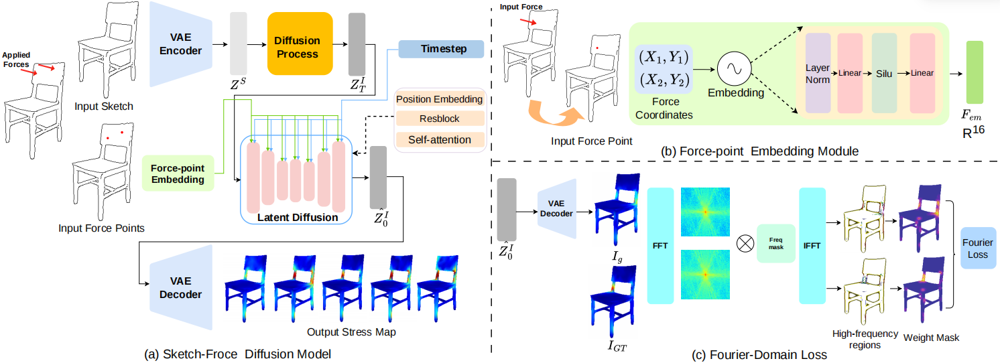
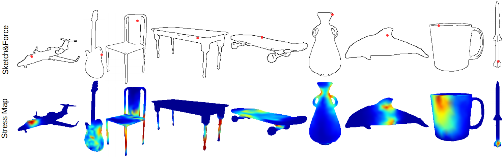
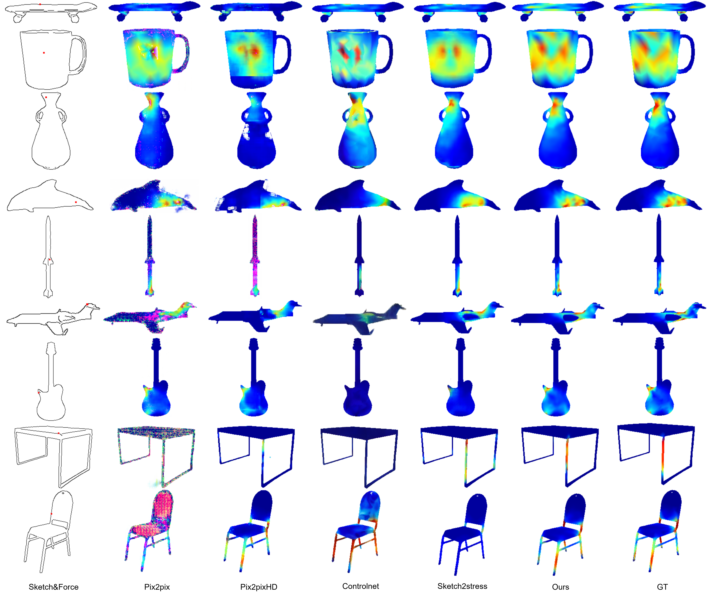
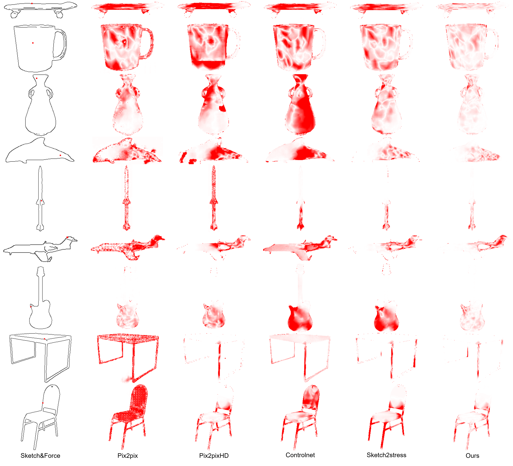

# *StructureLDM:*  A Latent Diffusion Model for Sketch-based Structural Analysis 
###### [**Deng Yu**](https://scholar.google.com/citations?user=Yi4KFWwAAAAJ&hl=en)&nbsp;&nbsp; [**Guangtao Liu**]() &nbsp;&nbsp; [**Lin Jiao**]() &nbsp;&nbsp;  [**Yujie Liu***]()&nbsp;&nbsp; [**Zhumin Chen**]() &nbsp;&nbsp; [**Wanchao Su**]() &nbsp;&nbsp;

######  1 School of Artificial Intelligence, Shandong University, Shandong, China
######  2 Qingdao Institute of Software, College of Computer Science and Technology, China University of Petroleum (East China), Shandong Key Laboratory of Intelligent Oil and Gas Industrial Software, China
######  3 SensiLab, Faculty of Information Technology, Monash University, Melbourne, Australia

###### * Corresponding author

###### Accepted by [PG 20206](https://pacificgraphics2026.github.io/)




**Fig. 1 **: Our StructureLDM enables fast, interactive structural analysis across various sketch-based application scenarios by allowing
users to apply forces (red dots) directly on the sketch. (a) shows sketch-based structural analysis for identifying the weak regions (warmer
colors) on the sketched structure. (b) illustrates how our StructureLDM supports users perform structural refinement on these weak regions
of sketches: the upper row presents the progressively refined sketches, while the bottom row shows corresponding stress maps computed by
our system. (c) demonstrates the application of our structural analysis to product sketches in the OpenSketch dataset

## Abstract

In the early stage of sketch-based product design for digital fabrication, rapid structural analysis serves as an efficient way to
analyze the weakness and optimize the structure of the designed product and is widely adopted in agile prototyping. However,
performing sketch-based structural analysis during the design phase is challenging due to the abstract nature of sketches,
improper representation of external forces, and insufficient analysis models. Existing sketch-based structural analysis methods
typically rely on simple mapping from input sketches and force maps to output stress maps in the generation procedure, suffering
from limited analysis quality due to poor spatial control of external forces. To address these challenges, we reformulate the
sketch-based structural analysis problem as a conditional generation task and propose StructureLDM, a novel framework for
sketch-based structural analysis that leverages the latent-diffusion model as the generative engine for the analytical stress map
synthesis. Our StructureLDM takes as input a sketch and the coordinates of the external force applied at the target position on
the sketch. With a specifically-designed force-point embedding module for precise spatial force control and a Fourier-domain
loss for the high-frequency contexts enhancement, it automatically predicts an accurate stress map. Comprehensive qualitative
and quantitative experiments show the effectiveness of our proposed method, significantly surpassing previous approaches in
terms of fine-grained spatial force controllability and high-precision stress map generation.

## Interface 



###### **Fig 2**: Our Sketching Interface.


## Pipeline



**Fig 3**:  The system diagram of StructureLDM. (a) shows the overall architecture: an input sketch is first encoded into a latent space via a
VAE encoder and then perturbed with noise (omitted here for clarity). Meanwhile, the input force point is projected into a high-dimensional
space through our force-point embedding module (FEM) and then concatenated with timestep to jointly guide the latent diffusion process.
The final stress map is then reconstructed from the refined latent code by the VAE decoder. (b) illustrates the force-point embedding module
(FEM), which maps 2D coordinates to a high-dimensional embedding space enabling a fine-grained, discriminative representation of the
force point. (c) depicts the Fourier-domain loss (FDL), which emphasizes the high-frequency details and better aligns the generated stress
map with the visual characteristics of the ground-truth stress distribution.

## Sketch-based Structure Analysis



**Fig 4**:  Nine representative categories in our collected dataset. The top row displays the input sketches with the applied external force
marked by red dots, while the bottom row shows the generated stress maps with our StructureLDM. 

## Qualitative comparison 



**Fig 5**: Qualitative comparison of different approaches. The leftmost column shows the input sketches and applied force, and the remaining
columns present the generated stress maps and the corresponding ground-truth results, respectively.

## Error maps of different approaches



###### **Fig 6**: Error maps of different approaches (visualizing the deviation between the generated and ground-truth stress maps). Less saturated red and lighter colors indicate smaller deviation from ground-truth. 

## Video

<video controls preload="metadata" width="1200" poster="">
  <source src="img/sketch2stress.mp4" type="video/mp4">
  你的浏览器不支持该视频播放
</video>


## Citation 

```tex
@ARTICLE{yu2024sketch2stress,
  author={Yu, Deng and Xiao, Chufeng and Lau, Manfred and Fu, Hongbo},
  journal={IEEE Transactions on Visualization and Computer Graphics}, 
  title={Sketch2Stress: Sketching With Structural Stress Awareness}, 
  year={2024},
  volume={30},
  number={10},
  pages={6851-6865},
  doi={10.1109/TVCG.2023.3342119}
  }
```


